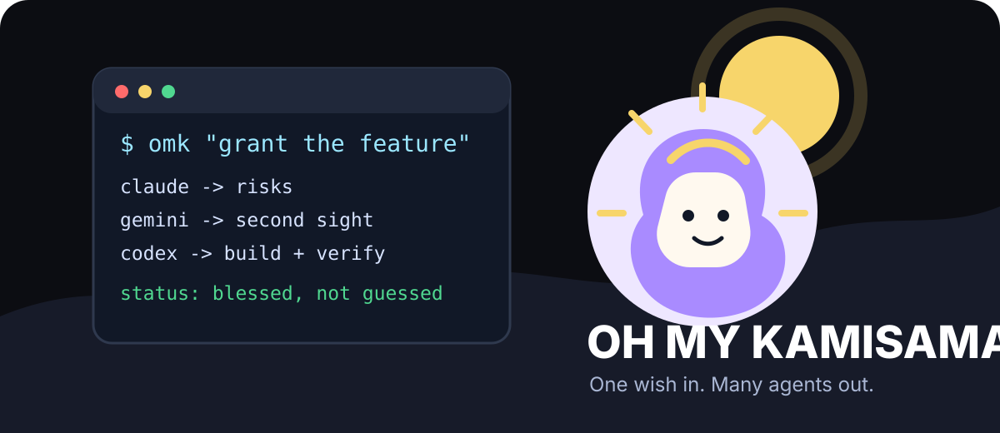
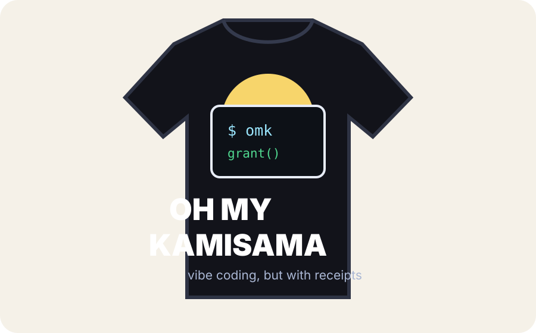

# oh-my-kamikama

<p align="center">
  
</p>

One command. Many agents. A suspicious amount of confidence.

`omk` is a local multi-CLI conductor for extreme vibe coding. You give it one
task. It asks multiple native coding agents to think about the task from
different angles, records their outputs as artifacts, then hands the final
execution to Codex with that context.

```bash
omk "fix the failing auth test and verify it"
```

Oh my god? No. Oh my Kamisama.

## What It Is

`oh-my-kamikama` is a command layer above the AI coding CLIs you already use.
It does not replace Claude Code, Codex CLI, Gemini CLI, opencode, OMX, OMO, or
cmux. It coordinates them.

The current core pipeline is:

```text
User task
  -> Claude advisor  -> writes claude.md
  -> Gemini advisor  -> writes gemini.md
  -> Codex executor  -> reads both artifacts, implements, verifies, summarizes
```

For longer work, `omk` can also run in the background and open a cmux cockpit:

```text
omk cockpit
  -> cmux workspace
     -> left pane:  omk watch
     -> right pane: omk bg + omk tail
```

The goal is a practical agent control room: one command starts the work, one
place shows what is running, and every lane leaves files you can inspect later.

`omk` also reads Agent Cat Connectors when available, so the interactive shell
can show local Codex/Claude/Gemini status, current process activity, and exposed
remaining quota percentages before routing work.

## Why This Exists

Most AI coding tools optimize for one runtime:

- Codex layers focus on Codex workflows, hooks, skills, and teams.
- Claude layers focus on Claude Code sessions, permissions, and planning.
- Gemini is useful as an independent second read.
- opencode/OMO can add another model lane and terminal-native workflows.
- OMX adds durable goals, teams, hooks, and HUD-like runtime support.
- cmux makes long-running panes visible and controllable.

`omk` takes the boring but useful path: keep the native tools installed and make
them cooperate from one command.

This is intentionally not a token-saving tool. The point is to spend more agent
attention when the job is ambiguous, risky, or large enough that one model's
first answer is not enough.

## What You Get

`omk` is useful when you want:

- A second and third opinion before code changes happen.
- A final executor that sees advisory context but still owns the implementation.
- Durable run artifacts under `.omk/` instead of one giant disappearing chat.
- Background jobs you can inspect with `omk ps`, `omk logs`, and `omk tail`.
- A cmux workspace that shows status and logs while the agents run.
- A future path to plug in OMX goals, OMO/opencode scout lanes, and richer QA.

It is especially good for:

- "I know what I want, but the implementation path is fuzzy."
- "This can burn tokens, just make the result better."
- "I want Claude/Gemini/Codex to all touch the problem, but not manually."
- "I want long agent runs visible in cmux instead of hidden in one terminal."

It is not magic:

- Each CLI still needs its own auth/login.
- Advisor output is context, not authority.
- Codex still has to inspect the repo and verify the change.
- Failing agents are surfaced, not hidden.

## The Wish Contract

Agents are wish-granting machines. They often grant vague wishes literally.
`omk` borrows the divecode "genie principle": before the executor grants the
wish, advisors should surface missing constraints, risks, gates, and verification.

```text
Vague wish:
  "make auth better"

Advisor work:
  - What auth flow?
  - What users are affected?
  - What should not change?
  - What tests prove this?
  - What could break in production?

Executor work:
  - Read advisor artifacts
  - Inspect the repo
  - Make the narrowest useful change
  - Run focused verification
  - Summarize what changed and what remains
```

AI-DLC gives the larger lifecycle shape:

```text
Inception    -> clarify requirements, constraints, risks
Construction -> implement with tests and verification
Operations   -> handoff, logs, deploy notes, follow-up checks
```

## Requirements

Core:

- `claude` CLI authenticated
- `codex` CLI authenticated
- `gemini` CLI authenticated
- macOS, Linux, or WSL with Bash
- Node.js 20+ if installing as an npm package

Optional:

- `cmux` for cockpit mode
- `omx` / `oh-my-codex` for future durable goal/team adapters
- `opencode` for future scout/reviewer lanes
- `agentcat` / Agent Cat Connectors for usage, quota, and activity snapshots

Check your local setup:

```bash
omk doctor
omk tools
omk agents
```

`omk doctor` checks the command surface. It does not replace each provider's
own login or billing/auth checks.

`npm install -g .` runs the Agent Cat Connectors installer automatically unless
`OMK_SKIP_AGENTCAT_INSTALL=1` is set. You can also run it manually:

```bash
omk connect
```

## Install

From this repository:

```bash
npm install -g .
```

Or run directly:

```bash
./bin/omk doctor
./bin/omk "summarize this repo and suggest the first safe improvement"
```

## Quick Start

Open the interactive conductor:

```bash
cd /path/to/repo
omk
```

Then type a task:

```text
Agents
------
agent    cli     state      quota-left         week     proc  cpu     mem
codex    yes     ok         70.0% 7d           713.0M   5     0.0%    207M
claude   yes     ok         92.0% 7d           784.6M   5     0.0%    458M
gemini   yes     ok         94.0% Gemini Pro   5.8M     38    0.0%    163M

activity: walking | suggested: claude (92.0)

omk:auto app> fix the failing parser regression and run the focused tests
```

Run the full conductor:

```bash
omk "fix the failing parser regression and run the focused tests"
```

By default, a plain task uses `omk auto`. Auto mode reads Agent Cat quota and
availability, prefers Codex/Claude, and only falls back to Gemini when Codex and
Claude are unavailable. Gemini fallback asks for confirmation in interactive
runs because Gemini quota can be precious or tied to a different account.

Run against another repository:

```bash
omk --repo /path/to/repo "add validation for empty import names"
```

Planning/advice only:

```bash
omk advise --repo /path/to/repo "review the migration plan before coding"
```

Run in the background:

```bash
omk bg --repo /path/to/repo "refactor the settings screen and verify it"
omk ps --repo /path/to/repo
omk tail --repo /path/to/repo latest
```

Open the cmux control room:

```bash
omk cockpit --repo /path/to/repo "ship the feature with tests and notes"
```

## How It Works

### 1. A run directory is created

Every foreground run creates a timestamped artifact directory:

```text
.omk/runs/<timestamp>-<task>/
```

The original task is stored in `task.txt`, and a summary packet is stored in
`RUN.md`.

### 2. Claude and Gemini advise in parallel

`omk` asks both advisors for the same structured read:

- Recommended approach
- Dive questions
- AI-DLC phase and gates
- Risks
- Verification
- What Codex should avoid

The advisors are intentionally read-only. They should not edit files. Their job
is to widen the problem framing before the executor changes anything.

Today the native calls are intentionally simple:

```text
claude --print --permission-mode plan "<advisor prompt>"
gemini --skip-trust --approval-mode plan --prompt "<advisor prompt>"
codex exec --skip-git-repo-check -C <repo> -s workspace-write "<executor prompt>"
```

That means provider auth, model selection, local policy, and account limits stay
with the provider CLIs. `omk` only creates the prompts, runs the commands,
captures their outputs, and connects the artifacts.

### 3. Advisor outputs become artifacts

The outputs are wrapped into:

```text
claude.md
gemini.md
```

Each file includes the provider name, exit code, stdout, and diagnostics. This
makes failures debuggable and makes successful advice reusable.

### 4. Codex executes with context

Codex receives a prompt that points at both advisor artifacts. It is told to use
the advisors as context, not authority. It still needs to inspect the repository,
preserve unrelated user changes, implement the task, and verify the result.

### 5. Logs and outputs stay on disk

Foreground runs write:

```text
.omk/runs/<timestamp>-<task>/
  RUN.md
  task.txt
  claude.md
  gemini.md
  codex.prompt.md
  codex.out
  codex.err
```

Background runs write:

```text
.omk/bg/<timestamp>-<task>/
  status
  pid
  started.txt
  finished.txt
  task.txt
  repo.txt
  stdout.log
  stderr.log
  run_dir.txt
```

## Command Reference

```bash
omk
omk "task"
omk shell [--repo PATH]
omk auto [--repo PATH] "task"
omk run [--repo PATH] "task"
omk claude [--repo PATH] "task"
omk gemini [--repo PATH] "task"
omk advise [--repo PATH] "task"
omk bg [--repo PATH] "task"
omk cockpit [--repo PATH] "task"
omk agents
omk connect
omk context [--repo PATH]
omk diff [--repo PATH]
omk cost
omk tasks [--repo PATH]
omk task [--repo PATH] <add|done|list> [...]
omk watch [--repo PATH] [job-id|latest]
omk ps [--repo PATH]
omk logs [--repo PATH] [job-id|latest]
omk tail [--repo PATH] [job-id|latest]
omk kill [--repo PATH] <job-id|latest>
omk tools
omk status
omk doctor
```

### `omk`

With no arguments in an interactive terminal, `omk` opens a small prompt:

```text
oh-my-kamikama 0.5.0
repo: /path/to/repo
mode: auto

Agents
------
agent    cli     state      quota-left         week     proc  cpu     mem
codex    yes     ok         70.0% 7d           713.0M   5     0.0%    207M
claude   yes     ok         92.0% 7d           784.6M   5     0.0%    458M
gemini   yes     ok         94.0% Gemini Pro   5.8M     38    0.0%    163M

activity: walking | suggested: claude (92.0)

Type a task, /agents to refresh, /mode to switch, /help for commands, /exit to quit.

omk:auto repo>
```

Plain text is treated as a task and runs in the current mode. Slash commands
control the shell:

```text
/mode auto      choose the executor from Agent Cat quota/availability
/mode run       full Claude + Gemini + Codex pipeline
/mode claude    direct Claude executor
/mode gemini    direct Gemini executor
/mode advise    advisors only
/mode bg        start background jobs
/mode cockpit   open a cmux cockpit for each task
/agents         refresh status, quota, activity, and suggested route
/route          print the current auto route
/connect        install/check Agent Cat Connectors
/context        show repo branch, scripts, surfaces, and route
/diff           show git status and diff stats
/cost           show Agent Cat usage/cost summary
/tasks          list the local .omk task queue
/task TASK      add a local task
/done ID        mark a local task done
/repo PATH      switch target repository
/ps             list background jobs
/logs latest    print the latest job logs
/tail latest    follow the latest job logs
/! git status   run a shell command inside the repo
```

Example interactive session:

```text
$ omk
omk:auto app> review the settings bug and fix it with tests
omk:auto app> /agents
omk:auto app> /mode cockpit
mode: cockpit
omk:cockpit app> build the admin audit view and verify it
omk:cockpit app> /exit
```

Use `omk shell --repo /path/to/repo` when you want to open the prompt for a
specific workspace.

The shell deliberately mirrors the useful parts of modern coding-agent CLIs:
slash commands, quick repo context, usage/cost views, diff views, and a small
local task queue. It does not embed or reuse proprietary agent source code.

### `omk auto`

Auto mode checks Agent Cat Connectors, displays the current provider picture,
and chooses the executor:

```text
1. Prefer Codex or Claude when either is available.
2. Between Codex and Claude, choose the one with the higher remaining quota.
3. Use Gemini only when Codex and Claude are unavailable.
4. Ask before using Gemini unless OMK_ALLOW_GEMINI_FALLBACK=1 is set.
```

```bash
omk auto --repo ~/work/app "fix the billing export and verify it"
```

If Agent Cat Connectors are missing, `omk` tries to install them. If usage
snapshot data is unavailable, auto mode falls back to CLI availability.

### `omk run`

Full foreground pipeline. Use it when you want the terminal to block until the
agents finish.

```bash
omk run --repo ~/work/app "fix checkout coupon validation and run tests"
```

This is the original three-lane pipeline: Claude advisor, Gemini advisor, then
Codex executor.

### `omk claude`

Direct Claude Code executor mode:

```bash
omk claude --repo ~/work/app "fix the settings crash and summarize verification"
```

### `omk gemini`

Direct Gemini executor mode. Auto mode asks before falling back to Gemini, but
this explicit command runs Gemini because you asked for it:

```bash
omk gemini --repo ~/work/app "fix the docs generator"
```

### `omk agents`

Prints the Agent Cat status table without opening the shell:

```bash
omk agents
```

### `omk connect`

Installs or checks Agent Cat Connectors:

```bash
omk connect
```

### `omk context`

Prints a compact repo snapshot:

```bash
omk context --repo ~/work/app
```

It includes the auto route, git branch, dirty file count, detected project
surfaces, and npm scripts when a `package.json` exists.

### `omk diff`

Shows git status plus unstaged/staged diff stats:

```bash
omk diff --repo ~/work/app
```

### `omk cost`

Shows Agent Cat usage/cost summary:

```bash
omk cost
```

### `omk task` / `omk tasks`

Stores a tiny local task queue under `.omk/tasks.tsv`:

```bash
omk task --repo ~/work/app add "write regression test"
omk tasks --repo ~/work/app
omk task --repo ~/work/app done 1
```

### `omk advise`

Advisor-only mode. Use it when you want Claude and Gemini to critique a plan
before any executor changes files.

```bash
omk advise --repo ~/work/app "should we move this cache into Redis?"
```

### `omk bg`

Starts the same pipeline through a background supervisor and writes job state
under `.omk/bg/`.

```bash
omk bg --repo ~/work/app "modernize the billing settings page"
omk ps --repo ~/work/app
omk logs --repo ~/work/app latest
```

### `omk cockpit`

Creates a cmux workspace with two panes:

- left pane: `omk watch`, refreshed job status plus stdout/stderr tails
- right pane: starts `omk bg`, then follows logs with `omk tail`

```bash
omk cockpit --repo ~/work/app "finish the dashboard filters and verify e2e"
```

This is the mode to use when the work may take a while and you want a visible
control room instead of a hidden background process.

### `omk watch`

Shows a lightweight terminal dashboard for background jobs:

```bash
omk watch --repo ~/work/app latest
```

Set the refresh interval:

```bash
OMK_WATCH_INTERVAL=5 omk watch --repo ~/work/app latest
```

## Examples

### Fix a bug with multiple reads

```bash
omk --repo ~/work/api "fix the refresh-token race and add a regression test"
```

What happens:

- Claude lists risks and missing constraints.
- Gemini provides an independent failure-mode read.
- Codex implements the fix with both artifacts in context.
- You get `.omk/runs/...` for review.

### Ask for plan pressure before implementation

```bash
omk advise --repo ~/work/api "review the safest migration path for user_roles"
```

Use this when the next step should be a decision, not a code edit.

### Start a long run and come back later

```bash
omk bg --repo ~/work/site "replace the old theme tokens and verify screenshots"
omk ps --repo ~/work/site
omk tail --repo ~/work/site latest
```

If the job finishes, inspect the final packet:

```bash
omk logs --repo ~/work/site latest
```

### Open a cmux cockpit

```bash
omk cockpit --repo ~/work/product "build the first pass of the admin audit view"
```

Expected shape:

```text
cmux workspace
  left:  watch pane with status, pid, stdout tail, stderr tail
  right: runner pane that starts the job and follows logs
```

This is the foundation for the bigger vision: `omk` as a cmux-native agent
cockpit where Claude, Codex, Gemini, OMX, OMO, opencode, QA, review, and release
lanes can become visible panes instead of hidden subprocesses.

### Continue even if an advisor fails

By default, `omk run` stops before Codex when Claude or Gemini fails. For
best-effort work:

```bash
OMK_KEEP_GOING=1 omk --repo ~/work/app "continue even if one advisor is down"
```

The failed advisor still gets an artifact with diagnostics.

## Testing

Run the local test suite:

```bash
npm test
```

The test suite uses fake `claude`, `gemini`, `codex`, and `cmux` commands for
offline coverage of the pipeline and cockpit generator. It does not spend model
tokens.

Run the real quantitative smoke test:

```bash
scripts/quant-smoke.sh 2
```

That installs the local package globally, runs `omk run` repeatedly, and writes
a CSV with:

- run status
- duration
- Claude advisor exit code
- Gemini advisor exit code
- Codex sentinel detection
- artifact count
- run directory

Use the quantitative smoke only when you actually want live model calls.

## Design Principles

- Native CLIs stay native. `omk` coordinates; it does not impersonate providers.
- Artifacts beat memory. Every run should leave inspectable files.
- Advisors widen context. Executors still own final judgment.
- Visibility matters. Long-running work should be watchable.
- Failures are data. A failed lane should produce diagnostics, not disappear.
- Token thrift is not the north star. Better outcomes are.

## Current Positioning

`oh-my-kamikama` sits above the local tools:

```text
Claude + Gemini -> independent advice
Codex           -> final executor
opencode        -> optional future scout/reviewer lane
OMX             -> optional future goals/team/HUD lane
cmux            -> visible pane/runtime lane
omk             -> run packet, artifacts, and routing
```

See [docs/strategy.md](docs/strategy.md) for the roadmap.

## Shirt Mode

<p align="center">
  
</p>

No official merch. Just a warning label for people who think one model should
make all the decisions alone.

## License

MIT
