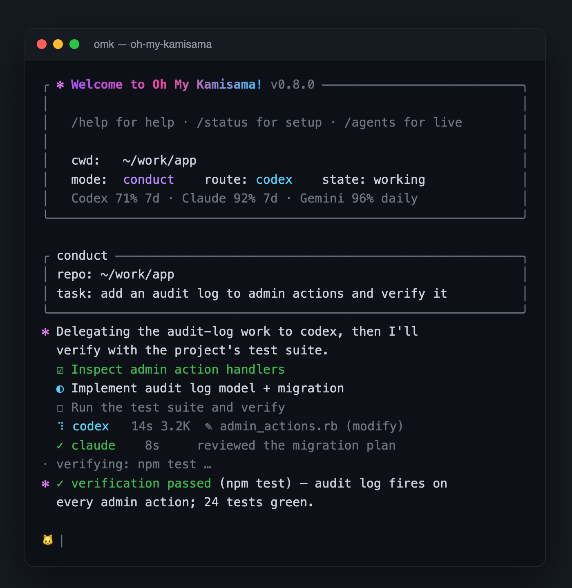

<p align="center">
  
</p>

<h1 align="center">oh-my-kamisama</h1>

<p align="center">
  <b>One command. Many agents. A suspicious amount of confidence.</b><br/>
  <sub>A local multi-CLI conductor for extreme vibe coding.</sub>
</p>

<p align="center">
  <a href="#install"></a>
  <a href="#requirements"></a>
  
  
  
</p>

<p align="center">
  <b>English</b> · <a href="README.ko.md">한국어</a>
</p>

<p align="center">
  <code>omk</code> turns a native <code>claude</code> session into a <b>conductor</b>: it plans your task,
  delegates each piece to <code>codex</code> / <code>claude</code> / <code>gemini</code>,<br/>
  reads the <b>real git diff</b> the workers produced, runs your tests, and only then calls it done —
  with every turn left as <b>artifacts on disk</b>.
</p>

```bash
omk "add an audit log to the admin actions and verify it"
```

> *Oh my god? No. Oh my Kamisama.*

<p align="center">
  
</p>

---

## Table of contents

- [Why this exists](#why-this-exists)
- [How the conductor works](#how-the-conductor-works)
- [Install](#install)
- [Quick start](#quick-start)
- [Interactive shell](#interactive-shell)
- [Modes](#modes)
- [Artifacts on disk](#artifacts-on-disk)
- [Command reference](#command-reference)
- [Configuration](#configuration)
- [Examples](#examples)
- [Cockpit mode](#cockpit-mode-cmux)
- [Where it fits](#where-it-fits-omo--omx--cmux)
- [Design principles](#design-principles)
- [Testing](#testing)
- [Roadmap](#roadmap)
- [Merch](#merch)
- [License](#license)

---

## Why this exists

Most AI coding tools optimize for **one runtime**:

| Tool | Great at | Doesn't do |
|---|---|---|
| Codex layers | Codex workflows, hooks, skills, teams | Cross-provider second opinions |
| Claude Code layers | Claude sessions, planning, permissions | Multi-executor handoff |
| Gemini CLI | An independent third read | Long-running orchestration |
| opencode / OMO | Terminal-native model lanes | Foreground/background packet routing |
| OMX | Durable goals, teams, HUD | An independent advisor swarm |

`omk` takes the boring-but-useful path: **keep the native tools installed and make them cooperate from one command.**

It is intentionally *not* a token-saving tool. The point is to **spend more agent attention** when the job is ambiguous, risky, or large enough that one model's first answer isn't enough — and to make that work **visible and auditable** instead of hidden inside one disappearing chat.

`oh-my-kamisama` is a **command layer above the AI coding CLIs you already use**. It does not replace Claude Code, Codex CLI, Gemini CLI, opencode, OMX, OMO, or cmux. It coordinates them.

<p align="center">
  
</p>

---

## How the conductor works

The headline mode (`omk conduct`, and the default for a plain task in the shell) makes a native `claude` session the **conductor**. It never edits files itself — it plans, delegates to worker CLIs, reads what they actually changed, and decides the next step. Each turn it returns a strict JSON envelope that `omk` renders into a live surface.

```text
You: omk "add an audit log to the admin actions and verify it"

  ┌─ conductor (a claude session) ──────────────────────────────────┐
  │  • maintains a live ☐ / ◐ / ☑ plan you watch update each turn   │
  │  • delegates each step to the right worker:                     │
  │       codex   → implements        (workspace-write)             │
  │       claude  → reasons / reviews (acceptEdits)                 │
  │       gemini  → grunt work / web search                         │
  │  • ◀── is fed the REAL `git diff` the workers produced          │
  │  • runs your project's tests/build before it says "done"        │
  └─────────────────────────────────────────────────────────────────┘
                              │
                              ▼
   .omk/runs/<run>/  →  plan.json · turn-N.json · turn-N.diff
                        session.json · verify-N.txt · <agent>.N.out
```

What makes it feel like Claude Code — and not like a black box:

- **Live plan checklist.** The conductor maintains an evolving `☐ / ◐ / ☑` plan and re-emits it every turn, so you always see where it is.
- **Streaming workers.** Each delegation shows an animated status line with elapsed time, bytes streamed, and the worker's current activity (the file it's editing, the command it just ran) — not a frozen wait.
- **Real diff awareness.** After every round the conductor is fed the *actual* `git diff` the workers produced, not their prose claim. Empty or wrong diffs get caught and re-delegated.
- **Verification gate.** Before it declares the task done on a changed repo, `omk` runs the project's own tests/build (`npm test`, `cargo test`, `go test`, or a `make test` target) and feeds the result back. It won't quietly call unverified work "done."
- **Parallel isolation.** When the conductor dispatches several writers at once, each runs in its own throwaway `git worktree` and the changes are merged back — concurrent agents can't stomp each other.
- **Loud failures.** A worker timeout, crash, or quota error is surfaced the instant it happens, not buried in a digest.
- **Resumable.** Every run persists its `claude` session id and turn history, so `omk resume` picks up exactly where you left off.

> Agents are wish-granting machines, and they grant vague wishes literally. The conductor's job is to surface the missing constraints, see what actually changed, and verify it — before anyone calls it done.

The worker calls stay deliberately native — provider auth, model selection, and account limits live in the provider CLIs:

```text
claude -p --output-format json --permission-mode acceptEdits   "<worker task>"
codex  exec --skip-git-repo-check --json -s workspace-write     "<worker task>"
gemini --skip-trust --approval-mode auto_edit -p                "<worker task>"
```

---

## Install

### From npm

```bash
npm install -g oh-my-kamisama
```

### From this repository

```bash
git clone https://github.com/yong076/oh-my-kamisama
cd oh-my-kamisama
npm install -g .
```

### Run directly without installing

```bash
./bin/omk doctor
./bin/omk "summarize this repo and suggest the first safe improvement"
```

> `npm install -g .` runs the Agent Cat Connectors installer automatically unless `OMK_SKIP_AGENTCAT_INSTALL=1` is set. You can also run it later with `omk connect`.

### Requirements

**Core**

- `claude` CLI — authenticated
- `codex` CLI — authenticated
- `gemini` CLI — authenticated
- macOS, Linux, or WSL with Bash
- Node.js 20+

**Optional**

- `cmux` — cockpit mode
- `omx` / `oh-my-codex` — future durable goal/team adapters
- `opencode` — future scout/reviewer lanes
- `agentcat` / Agent Cat Connectors — usage, quota, and activity snapshots

### Verify your setup

```bash
omk doctor    # checks the command surface (not provider auth)
omk tools     # lists what omk can call
omk agents    # live quota/activity (needs Agent Cat Connectors)
```

---

## Quick start

Open the interactive conductor in the current repo:

```bash
cd /path/to/repo
omk
```

…then just type a task. In the shell, a plain task runs the **conductor**.

Or run it one-shot:

```bash
omk conduct --repo ~/work/app "fix the failing parser regression and run the focused tests"
omk resume  --repo ~/work/app            # pick the last run back up
```

> A bare `omk "task"` on the command line uses quota-aware single-executor [`omk auto`](#omk-auto--quota-aware-routing). For the full multi-agent loop from the CLI, use `omk conduct` (it's the default when you type a task **inside** the shell).

### Common one-liners

```bash
# The conductor against another repo
omk conduct --repo ~/work/app "build the admin audit view with tests"

# Advisors only — a decision, not a code edit
omk advise  --repo ~/work/app "review the safest migration path for user_roles"

# A long run in the background, watched
omk bg   --repo ~/work/app "refactor the settings screen and verify it"
omk ps   --repo ~/work/app
omk tail --repo ~/work/app latest
```

---

## Interactive shell

With no arguments in an interactive terminal, `omk` opens a small REPL with a Claude-Code-style launch screen, live agent status, and the conductor wired in (see the screenshot up top):

```text
╭ ✻ Welcome to Oh My Kamisama! v0.8.0 ──────────────────────────╮
│   cwd:   ~/work/app                                            │
│   mode:  conduct    route: codex    state: working            │
│   Codex 71% 7d · Claude 92% 7d · Gemini 96% daily             │
╰────────────────────────────────────────────────────────────────╯
🐱 add an audit log to admin actions and verify it
```

Plain text is treated as a task and runs in the current mode. The TTY shell uses a real terminal editor (`bin/omk-repl.js`): arrow movement, multiline input (Shift/Meta+Enter or `\`+Enter), history, slash autocomplete, and a live conductor surface. Non-interactive stdin falls back to a simpler Bash loop so scripts and tests stay clean.

| Command | What it does |
|---|---|
| `/conduct TASK` | Run the multi-agent conductor (plan, delegate, diff, verify) |
| `/resume [run\|latest]` | Resume a previous conductor run |
| `/mode conduct\|auto\|run\|claude\|gemini\|advise\|bg\|cockpit` | Set how plain tasks run |
| `/agents` | Refresh status, quota, activity, suggested route |
| `/context` | Repo branch, scripts, surfaces, route |
| `/diff` | Git status and diff stats |
| `/cost` | Agent Cat usage/cost summary |
| `/tasks`, `/task TEXT`, `/done ID` | Local `.omk` task queue |
| `/ps`, `/logs latest`, `/tail latest`, `/watch latest`, `/kill latest` | Background job controls |
| `/repo PATH` | Switch target repository |
| `/refresh`, `/screen`, `/route`, `/connect`, `/tools`, `/status`, `/doctor` | Status & setup |
| `/! git status` | Run a shell command inside the repo |
| `/help`, `/shortcuts`, `/exit` | Help, keys, quit |

---

## Modes

### `omk conduct` — the multi-agent conductor

The headline mode. A `claude` session plans, delegates to `codex` / `claude` / `gemini`, reads the real diff, and verifies — see [How the conductor works](#how-the-conductor-works).

```bash
omk conduct --repo ~/work/app "add an audit log to the admin actions and verify it"
```

Tunables: `OMK_CONDUCT_MAX_TURNS`, `OMK_CONDUCT_CONCURRENCY`, `OMK_CONDUCT_VERIFY=0` (skip the test gate), `OMK_CONDUCT_WORKTREES=0` (run in-repo instead of isolated worktrees).

### `omk resume` — continue a previous conductor run

Every run persists its session id and turn history. `omk resume` reuses them, replays the current repo diff to the conductor, and continues.

```bash
omk resume --repo ~/work/app                # the latest run
omk resume --repo ~/work/app 2026-05-30T17-15-26Z-build-the-feature
```

### `omk auto` — quota-aware single executor

Checks Agent Cat Connectors and runs **one** executor directly:

1. Prefer Codex or Claude when either is available.
2. Between them, pick the higher **remaining quota**.
3. Use Gemini only when both are unavailable — and **ask first** unless `OMK_ALLOW_GEMINI_FALLBACK=1`.

```bash
omk auto --repo ~/work/app "fix the billing export and verify it"
```

### `omk run` — the advisor pipeline

The original three-lane pipeline: a Claude advisor and a Gemini advisor each write a structured read (approach, dive questions, AI-DLC gates, risks, verification), then Codex implements with both artifacts in context.

```bash
omk run --repo ~/work/app "fix checkout coupon validation and run tests"
```

### `omk advise` — advisors only

When the next step should be a **decision, not a code edit**. Claude and Gemini produce their reads; no executor runs.

```bash
omk advise --repo ~/work/app "should we move this cache into Redis?"
```

### `omk claude` / `omk gemini` — direct executor

Skip routing and use one provider directly.

```bash
omk claude --repo ~/work/app "fix the settings crash and summarize verification"
```

### `omk bg` — background jobs

Runs the pipeline through a background supervisor with inspectable job state under `.omk/bg/`. The supervisor and `omk kill` tear down the **whole** worker process tree, not just the launcher.

```bash
omk bg   --repo ~/work/app "modernize the billing settings page"
omk ps   --repo ~/work/app
omk tail --repo ~/work/app latest
omk kill --repo ~/work/app latest
```

---

## Artifacts on disk

Every conductor run leaves a timestamped, auditable, resumable packet:

```text
.omk/runs/<timestamp>-<task>/
├── task.txt            ← the original task
├── session.json        ← claude session id + status (used by `omk resume`)
├── plan.json           ← the latest ☐/◐/☑ plan
├── turn-0.json         ← each conductor turn: message in, envelope out
├── turn-0.diff         ← the real git diff after that round
├── codex.0.out         ← each worker's captured output
└── verify-1.txt        ← the verification (tests/build) result
```

The advisor pipeline (`omk run` / `omk advise`) writes its own packet (`RUN.md`, `claude.md`, `gemini.md`, `codex.out/err`), and `omk bg` adds a supervisor record (`status`, `pid`, `stdout.log`, `stderr.log`, `run_dir.txt`).

This means **failures are debuggable**, **good advice is reusable**, and **reviews can be async** — open the packet later instead of hunting through scrollback.

---

## Command reference

```bash
omk                                      # interactive shell (a plain task → conductor)
omk "task"                               # one-shot, quota-aware auto
omk shell    [--repo PATH]               # explicit shell for a workspace

omk conduct  [--repo PATH] "task"        # multi-agent conductor (plan/delegate/diff/verify)
omk resume   [--repo PATH] [run|latest]  # resume a previous conductor run
omk auto     [--repo PATH] "task"        # quota-aware single executor
omk run      [--repo PATH] "task"        # advisor pipeline (Claude + Gemini → Codex)
omk advise   [--repo PATH] "task"        # advisors only
omk claude   [--repo PATH] "task"        # direct Claude executor
omk gemini   [--repo PATH] "task"        # direct Gemini executor

omk bg       [--repo PATH] "task"        # background pipeline
omk cockpit  [--repo PATH] "task"        # cmux cockpit + bg

omk agents                               # live agent table
omk connect                              # install/check Agent Cat Connectors
omk context  [--repo PATH]               # repo snapshot
omk diff     [--repo PATH]               # git status + diff stats
omk cost                                 # Agent Cat usage/cost summary

omk tasks    [--repo PATH]               # list local task queue
omk task     [--repo PATH] <add|done|list> [...]

omk watch    [--repo PATH] [job-id|latest]
omk ps       [--repo PATH]
omk logs     [--repo PATH] [job-id|latest]
omk tail     [--repo PATH] [job-id|latest]
omk kill     [--repo PATH] <job-id|latest>

omk tools                                # what omk can call
omk status                               # short status line
omk doctor                               # diagnostics
```

---

## Configuration

Behavior is controlled with environment variables. None are required.

| Variable | Default | Effect |
|---|---|---|
| `OMK_CONDUCT_MAX_TURNS` | `12` | Max conductor turns before it stops. |
| `OMK_CONDUCT_CONCURRENCY` | `3` | Max workers run in parallel per round. |
| `OMK_CONDUCT_VERIFY` | on | Set `0` to skip the test/build gate before `done`. |
| `OMK_CONDUCT_WORKTREES` | on | Set `0` to run parallel writers in-repo instead of isolated git worktrees. |
| `OMK_DELEGATE_TIMEOUT_MS` | `180000` | Per-worker timeout. |
| `OMK_ALLOW_GEMINI_FALLBACK` | unset | Auto mode falls back to Gemini **without** asking. |
| `OMK_KEEP_GOING` | unset | `omk run` proceeds to Codex even if an advisor fails. |
| `OMK_SKIP_AGENTCAT_INSTALL` | unset | Skip the Agent Cat Connectors installer on `npm install`. |
| `OMK_WATCH_INTERVAL` | `2` | Refresh interval (seconds) for `omk watch`. |
| `OMK_READLINE_REPL` | unset | Use the simpler readline shell instead of the terminal editor. |
| `OMK_NO_INTRO` / `OMK_ASCII` | unset | Skip the animated intro / drop color and emoji. |

---

## Examples

### Ship a feature, verified

```bash
omk conduct --repo ~/work/api "add rate limiting to the public API and add tests"
```

The conductor plans the steps, has codex implement them (in an isolated worktree), reads the diff back, runs `npm test`, and only reports done when it's green.

### Pick a long run back up

```bash
omk conduct --repo ~/work/api "migrate user_roles to the new schema"
# …step away, come back…
omk resume  --repo ~/work/api
```

### Plan pressure before any edit

```bash
omk advise --repo ~/work/api "review the safest migration path for user_roles"
```

### Start a long run and walk away

```bash
omk bg   --repo ~/work/site "replace the old theme tokens and verify screenshots"
omk tail --repo ~/work/site latest
```

---

## Cockpit mode (cmux)

`omk cockpit` opens a cmux workspace with a watch pane and a runner pane, so long work is a **visible control room** instead of a hidden background process:

```bash
omk cockpit --repo ~/work/product "build the first pass of the admin audit view"
```

```text
┌─ watch ──────────────────────┬─ runner ─────────────────────┐
│  status: running             │  omk bg + omk tail           │
│  stdout/stderr tail …        │  live log …                  │
└──────────────────────────────┴──────────────────────────────┘
```

---

## Where it fits (omo / omx / cmux)

`oh-my-kamisama` sits **above** the local tools:

```text
┌──────────────────────────────────────────────────────────┐
│  omk        ← conductor, run packets, artifacts, routing │
├──────────────────────────────────────────────────────────┤
│  codex    ─ implementation executor   (workspace-write)  │
│  claude   ─ conductor + reasoning/review worker          │
│  gemini   ─ grunt work / web search worker               │
├──────────────────────────────────────────────────────────┤
│  opencode ─ optional scout / reviewer lane               │
│  OMO      ─ optional model lane / terminal-native flow   │
│  OMX      ─ optional durable goals, teams, HUD           │
│  cmux     ─ visible panes / long-running runtime         │
│  agentcat ─ live quota, activity, cost snapshots         │
└──────────────────────────────────────────────────────────┘
```

`omk` does not replace any of them. It is the conductor that asks them to play together. See [`docs/strategy.md`](docs/strategy.md) and [`docs/competitive-scan.md`](docs/competitive-scan.md) for the longer roadmap.

---

## Design principles

- **Native CLIs stay native.** `omk` coordinates; it does not impersonate providers.
- **Diffs beat claims.** The conductor reasons over what actually changed on disk.
- **Verify before "done."** Unverified work isn't finished work.
- **Artifacts beat memory.** Every run leaves inspectable files you can resume from.
- **Visibility matters.** Long-running work should be watchable, and failures should be loud.
- **Token thrift is not the north star.** Better outcomes are.

---

## Testing

The local suite is fully offline — it uses fake `claude` / `codex` / `gemini` / `cmux` commands and burns no model tokens:

```bash
npm test
```

It covers the advisor pipeline, cockpit generator, shell modes and slash commands, auto-routing, repo surface detection, the Node REPL, and the conductor — including the plan/diff/worktree/verify path, resume, and the REPL→conductor wiring.

For a real quantitative smoke against live providers:

```bash
scripts/quant-smoke.sh 2
```

---

## Roadmap

Shipped in the conductor: live plan, streaming workers, real-diff awareness, the verification gate, worktree isolation, and resume.

Next:

- [ ] Unify plain-task routing so `omk "task"` and the shell behave identically
- [ ] `omk bg --conduct` to background the conductor (not just the advisor pipeline)
- [ ] OMX adapter — push run packets into OMX as durable goals
- [ ] opencode / OMO scout + reviewer lanes
- [ ] cockpit v2 — review / QA / release lanes as panes

---

## Merch

<p align="center">
  
</p>

No official merch. Just a warning label for people who think one model should make all the decisions alone.

---

## License

MIT © [yong076](https://github.com/yong076)
